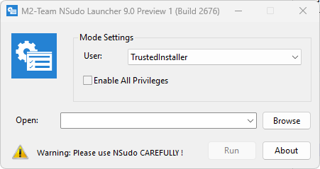

#  NSudo

[](https://github.com/powershello/NSudo/releases)
[](https://www.virustotal.com/gui/file/c191f4fa0285f0786e9bfbc3c761f89b694aab54409abec9d29321d4f6459154)
[](License.md)



**NSudo.cmd** is a 100% native PowerShell 5.1 / Batch polyglot that completely replaces the traditional C++ NSudo Launcher with a single, zero-compiled-binary `.cmd` script. No installation required — just one file.

---

## Features

- **Zero Compiled Binaries** — No `.exe` or `.dll` files required. The entire application — including the WinForms GUI and Win32 API bridge — is packed into a single `.cmd` file.
- **Defender-Friendly (0/62 VT)** — Designed to avoid triggering modern AV heuristics and Sigma rules. Uses `fltmc.exe` for elevation checks rather than common flagged patterns.
- **In-Memory UAC Elevation** — UAC re-launch and working directory preservation are handled entirely in-memory via Base64 encoding, with no temp files written to disk.
- **"Crazy Path" Immunity** — Correctly preserves working directories containing Unicode characters or square brackets `[ ]` across CMD, PowerShell, and PowerShell ISE, working around native Microsoft path-resolution bugs.
- **Win11 UWP Alias Bypass** — Explicitly resolves commands like `notepad` to `System32\notepad.exe`, preventing `Win32 Error 2` when launching under the `TrustedInstaller` identity.
- **Ghost-Window Free** — Routes non-PE targets like `.msc` files (e.g. `services.msc`) through `mmc.exe` automatically, preventing `Win32 Error 193`.
- **Drag-and-Drop GUI** — Native WinForms UI with dark mode support. Accepts file drag-and-drop directly onto the command field.

---

## Usage

### GUI

Download the latest [NSudo.cmd](https://github.com/powershello/NSudo/releases/download/NSudo/NSudo.cmd) and double-click to open the GUI. Select a user mode, toggle privileges, type or browse to a target, and click **Run**.

### Command Line

Run directly with arguments — no GUI will appear:

```bat
NSudo.cmd -U:T -P:E powershell
```

Or download and run in one step via **Win+R**:

```bat
cmd /c curl.exe -LSso %tmp%\.cmd https://github.com/powershello/NSudo/releases/download/NSudo/NSudo.cmd && %tmp%\.cmd
```

With arguments:

```bat
cmd /c curl.exe -LSso %tmp%\.cmd https://github.com/powershello/NSudo/releases/download/NSudo/NSudo.cmd && %tmp%\.cmd -U:T -P:E powershell
```

---

## Options

```
Format: NSudo.cmd [Options] <Command>

  -U:<Option>                 User context to launch the process under.
      T   TrustedInstaller
      S   System
      C   Current User
      E   Current User (Elevated)
      P   Current Process
      D   Current Process (Drop Rights)

  -P:<Option>                 Privilege adjustment for the launched process.
      E   Enable All Privileges
      D   Disable All Privileges

  -M:<Option>                 Mandatory integrity level for the process.
      S   System
      H   High
      M   Medium
      L   Low

  -Priority:<Option>          Process priority class.
      Idle
      BelowNormal
      Normal
      AboveNormal
      High
      RealTime

  -ShowWindowMode:<Option>    Window display mode.
      Show
      Hide
      Maximize
      Minimize

  -Wait                       Wait for the launched process to exit before returning.
  -CurrentDirectory:<Path>    Set the working directory for the launched process.
  -UseCurrentConsole          Attach the launched process to the current console window.
  -Version                    Display version information.
  -? / -H / -Help             Show help text.
```

---

## Technical Details

`NSudo.cmd` is a CMD / PowerShell polyglot: the CMD stub handles elevation and re-launch, then hands off to the embedded PowerShell code which reads and executes itself via `[System.IO.File]::ReadAllText`. No temp files are written.

The PowerShell layer dynamically compiles a C# class (`NSudoNativeBridge`) via `Add-Type`, exposing direct P/Invoke bindings to the following Win32 APIs:

| API | Purpose |
|---|---|
| `OpenProcessToken` | Acquire the token of an existing process |
| `DuplicateTokenEx` | Clone and adjust the token for the target identity |
| `SetTokenInformation` | Apply integrity level and other token attributes |
| `CreateProcessWithTokenW` | Launch the target process under the duplicated token |
| `CommandLineToArgvW` | Parse quoted command-line arguments correctly |

Working directory state is serialised as Base64 and passed through the UAC boundary via command-line arguments, ensuring "crazy path" directories survive the elevation round-trip intact.